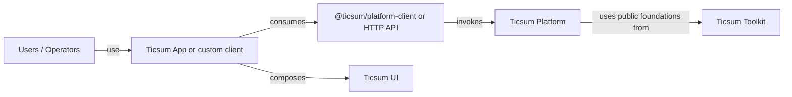

# Ticsum

Ticsum is a modular ecosystem for building, operating, and presenting configurable business applications with explicit boundaries between product behavior, technical foundations, reusable interfaces, and graphical clients.

## Architecture

```text
ticsum/
├── toolkit
├── platform
├── ui
└── app
```

The organization package scope is `@ticsum/*`.

### Toolkit

Ticsum Toolkit provides product-neutral technical foundations for lifecycle, HTTP, providers, identity, jobs, observability, and runtime composition. Its portable capabilities are public entry points of `@ticsum/toolkit`; separate packages exist only when a real dependency or runtime boundary requires them.

### Platform

Ticsum Platform is a headless business application platform. It owns business/domain behavior, products and resources, Application Operations, authoritative authorization, provider coordination, persistence boundaries, API runtime, workers, and framework-neutral Application Experience metadata.

The public Platform contract is its HTTP/API protocol. JavaScript and TypeScript consumers may use `@ticsum/platform-client`; other consumers may use the protocol directly. Graphical clients do not import Platform internals or connect directly to its persistence for canonical business operations.

### UI

Ticsum UI is a provider-neutral, multi-package presentation system. Supported `@ticsum/ui-*` packages provide primitives, components, layouts, systems, blocks, charts, icons, localization, styles, and theme capabilities without depending on Platform.

### App

Ticsum App is the canonical graphical application. It combines Nuxt, `@ticsum/platform-client`, and `@ticsum/ui-*` packages to provide routing, application shell, session UX, screen composition, request orchestration, and presentation state.

App is a consumer of Platform, not part of Platform. Business policy, authorization, persistence, provider implementations, operations, and domain mutations remain server-owned.

## High-level dependency direction



Custom React, Nuxt, mobile, industrial, and machine clients may consume the same Platform protocol. They are not required to reproduce the canonical app UX or use Ticsum UI.

## Deployment flexibility

Interface choice, hosting choice, persistence ownership, and provider ownership are independent decisions. Ticsum supports headless Platform deployments, the canonical Ticsum App, custom frontends, and existing-system integrations across customer-hosted, Ticsum-managed, and hybrid deployments.

Customer-managed persistence can remain under the customer's lifecycle and backup control while Platform stays the authoritative business-operation boundary. Provider credentials are configured server-side and never exposed to graphical clients.

## Engineering principles

- Business meaning stays with Platform products and Application Operations.
- Reusable technical foundations stay product-neutral.
- Reusable UI stays provider-neutral and independent from Platform.
- Public package APIs are defined by `package.json#exports`.
- Cross-package relative imports and physical `src` deep imports are prohibited.
- Provider-specific technology stays behind explicit server-side contracts and adapters.
- Graphical clients own presentation policy, not authoritative business or authorization policy.
- Security, observability, testing, and supply-chain controls are engineering constraints.

## Engineering areas

The ecosystem spans TypeScript, Node.js, Nuxt, Vue, package/workspace architecture, HTTP APIs, workers and jobs, persistence boundaries, provider adapters, reusable UI systems, automated testing, CI/CD, supply-chain controls, and architecture validation.
